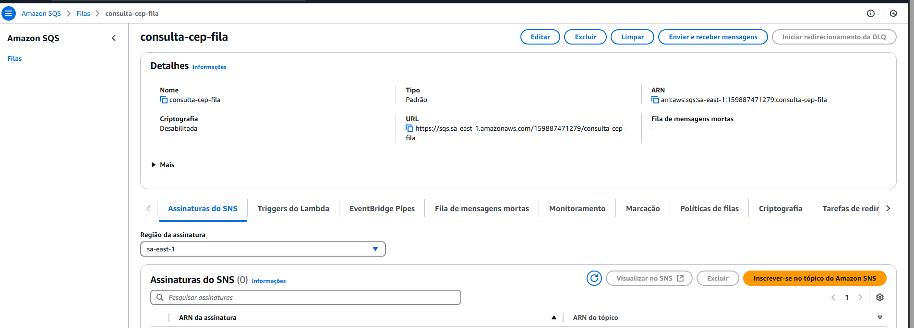
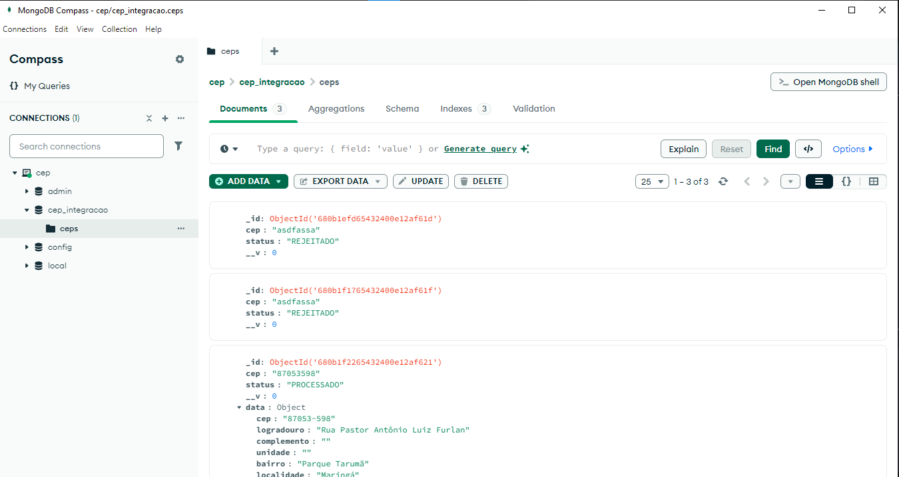

## Sobre o Projeto

Este projeto demonstra uma arquitetura Producer-Consumer para o processamento de consultas de CEPs. A aplicação é composta por dois componentes principais:

* **Produtor (API):** Uma API construída com Node.js e Express. Ela recebe um número de CEP através de uma requisição. Ao receber um CEP, o Produtor armazena essa informação em um banco de dados MongoDB, marcando o status como "PENDENTE". Em seguida, o Produtor envia o ID do registro MongoDB para uma fila no AWS SQS.

* **Consumidor (Processador):** Uma aplicação Node.js que roda continuamente e monitora a fila SQS. Quando o Consumidor recebe uma mensagem (contendo o ID de um registro de CEP), ele consulta um serviço externo (ViaCEP) para obter os detalhes do CEP. Com os dados retornados pelo ViaCEP, o Consumidor atualiza o registro correspondente no MongoDB, incluindo as informações e alterando o status para "CONCLUÍDO" em caso de sucesso ou "REJEITADO" em caso de falha. Após o processamento, a mensagem é removida da fila SQS.

O objetivo desta arquitetura é separar a responsabilidade de receber as requisições (Produtor) da responsabilidade de processá-las (Consumidor), utilizando uma fila de mensagens (AWS SQS) para gerenciar o fluxo de trabalho de forma assíncrona e escalável.

**Evidência de Funcionamento:**

A fila AWS SQS (`consulta-cep-fila`) foi utilizada para o envio dos IDs dos registros de CEP para processamento:

O banco de dados MongoDB (`cep_integracao`) contém os registros dos CEPs consultados, indicando o status do processamento e os dados obtidos da API ViaCEP:

Este projeto demonstra o fluxo completo de uma consulta de CEP, desde o recebimento pela API até o processamento em segundo plano e a atualização do banco de dados com os resultados.
